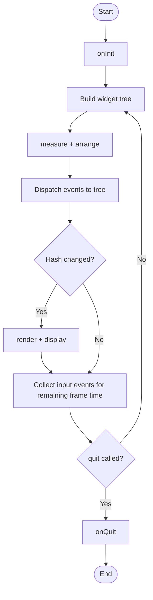

# TermUI

A simple DSL-based, widget-oriented TUI library for Nim. Think of it as something in the middle between raw terminal control and a full ncurses wrapper, but with a declarative approach to building interfaces.

## Status

Work in progress, but already usable. Here is where things stand:

**Working:**
- [App loop](#app-loop) with frame timing and hash-based conditional rendering
- [Event system](#event-handling) with full mouse and keyboard support; mouse events are automatically routed to the widget under the cursor, no manual hit testing needed
- [Layout engine](#layout-system) with flex, fill, fixed, and content sizing
- [Composable widget system](#macros) via `{.tui.}`, `{.widget.}`, and `with`

**Planned:**
- Stack direction for layered layouts, which will also enable dialog-style overlays
- More widgets and more examples

**Known issues:**
- The app crashes on very small terminal sizes (2-3 rows or columns); needs proper handling
- No fallback or error rendering when layout clips or fails; something like an `onError` hook per container is probably the right answer

**Intentionally out of scope:**
- Keyboard focus management: the library routes mouse events spatially and leaves everything else to the application. If you need keyboard focus, managing selected state yourself is straightforward, the [fruit counter example](examples/fruit_counter.nim) shows one way to do it
- Absolute coordinate containers: alignment plus padding covers the realistic use cases without the added complexity

## Why TermUI?

Started this for my own use in [StorageDetective](https://github.com/SolracHQ/StorageDetective). I wanted something more declarative than raw illwill but not as heavy as a full ncurses wrapper. The DSL approach makes it easier to reason about layouts without dealing with manual positioning and size calculations.

## Installation

```
nimble install https://github.com/SolracHQ/termui
```

## Quick Example

```nim
import termui

proc main() {.tui.} =
  with newLabel("Hello, World!", style = {styleBright}, fgColor = fgGreen)

  with newLabel(
    "This text will be truncated with ellipsis",
    modifier = newModifier(width = fixed(20)),
    overflowStrategy = osEllipsis,
    fgColor = fgYellow,
  )

  onEvent e:
    if e.kind == ekKey and e.key.name == "Escape":
      quit()

when isMainModule:
  main()
```

The `{.tui.}` pragma handles all the boilerplate: terminal initialization, event loop with proper frame timing, terminal cleanup, and Ctrl+C handling. You just write your UI declaratively.

## Composable Widgets

You can create reusable components using the `{.widget.}` pragma:

```nim
type AppState = ref object
  count: int

proc button(text: string, state: AppState, onClick: proc()) {.widget.} =
  with newLabel(text, fgColor = fgYellow, style = {styleBright}):
    onEvent e:
      if e.kind == ekKey and e.key.name == "Enter":
        onClick()
        return true
      elif e.kind == ekMouseButton and e.mouseButton.action == mbaPressed:
        onClick()
        return true

proc counter(state: AppState) {.widget.} =
  with newContainer(direction = drVertical):
    with newLabel("Count: " & $state.count, fgColor = fgCyan)

    with newContainer(direction = drHorizontal):
      with button("[-]", state, proc() = state.count.dec())
      with button("[+]", state, proc() = state.count.inc())

proc main() {.tui.} =
  onInit:
    let state = AppState(count: 0)

  with counter(state)
  with button("Reset", state, proc() = state.count = 0)

  onEvent e:
    if e.kind == ekKey and e.key.name == "Escape":
      quit()

when isMainModule:
  main()
```

The `{.widget.}` pragma transforms your proc into a function that returns a `Widget`, letting you compose complex UIs from simple, reusable pieces. Use ref objects for state to avoid closure issues.

## Modifier System

Most layout and style properties are bundled into a `Modifier`, instead of scattered across individual widget parameters. This keeps the API consistent and composable:

- **Border:** single or double line border around the widget
- **Padding:** inner spacing with per-side control
- **Background:** fill the widget area with a background color
- **Spacing:** gap between children in a container
- **Alignment:** how children align on the cross axis (`alStart`, `alCenter`, `alEnd`, `alStretch`)
- **Size:** `width` and `height` as `SizeSpec` values

```nim
with newContainer(
  modifier = newModifier(
    hasBorder = true,
    padding = padding(horizontal = 2, vertical = 1),
    alignment = alCenter,
    width = fill(),
    spacing = 1,
  ),
  direction = drHorizontal,
):
  with newLabel("Hello")
  with newLabel("World")
```

The `padding()` constructor accepts `all`, `vertical`, `horizontal`, or individual sides, whatever is most convenient.

## Event Handling

The library has a built-in event system with full mouse support. You can handle events at any level of the widget tree:

```nim
proc main() {.tui.} =
  with newLabel("Click me or press ENTER"):
    onEvent e:
      case e.kind
      of ekKey:
        if e.key.name == "Enter":
          return true
      of ekMouseButton:
        if e.mouseButton.action == mbaPressed:
          return true
      else:
        discard

  onEvent e:
    if e.kind == ekKey and e.key.name == "Escape":
      quit()
```

Events bubble up from child widgets to parents. Return `true` from a handler to stop propagation. Mouse events are automatically bounds-checked; child widgets only receive them when the cursor is within their calculated rectangle.

Available event types:

- `ekKey`: keyboard input
- `ekMouseMove`: mouse movement (with button state)
- `ekMouseButton`: mouse button press/release
- `ekMouseScroll`: mouse wheel
- `ekUpdate`: fired every frame with delta time, useful for animations or timers
- `ekFrameLag`: frame took longer than the target duration

## Mouse Support

Mouse works on both Windows and Unix. Both platforms had different bugs that completely broke mouse input, both are fixed now, and the fixes have been contributed back upstream to illwill.

## App Loop

Here is how the main loop works under the hood, in case you want to understand what `{.tui.}` is actually doing:



Each frame the tree is rebuilt and measured, then rendered only if the hash of the widget tree changed. This keeps rendering cheap; if nothing changed, nothing is drawn.

The `ekUpdate` event is injected every frame with the delta time since the last frame. Use it for timers, animations, or anything time-based.

## Macros

Most of the complexity lives in two pragmas and one macro: `{.tui.}`, `{.widget.}`, and `with`.

`with` is the core building block. It takes a widget expression and an optional body, injects `self` pointing to that widget, processes any nested `with` calls as children added to the parent, and wires up `onEvent` handlers. Everything else builds on top of it.

`{.tui.}` rewrites the proc body into the full app loop, separating out `onInit`, `onQuit`, and the widget tree code, then wrapping everything in the frame timing and event collection logic.

`{.widget.}` changes the proc's return type to `Widget` and wraps the body in a `with` call on a fresh `Container`, so the proc builds and returns a widget subtree.

## Lifecycle Hooks

Use `onInit` and `onQuit` for setup and cleanup:

```nim
proc main() {.tui.} =
  onInit:
    let state = AppState()

  with newLabel("My App")

  onQuit:
    echo "Cleaning up..."
```

`onInit` and `onQuit` only work at the top level of the entry proc, not inside widget definitions. Variables declared in `onInit` are available throughout the entire application.

## Available Widgets

- `newLabel`: single line text with overflow strategies (`osClip`, `osEllipsis`, `osWrap`)
- `newTextBox`: multi-line text display
- `newRect`: colored rectangle, useful for backgrounds or decorative elements
- `newContainer`: layout container with configurable direction (`drHorizontal` or `drVertical`)

## Layout System

Sizes are expressed as `SizeSpec` values:

- `fill()`: take all available space
- `flex(ratio)`: take space proportional to the ratio (default 1)
- `fixed(n)`: fixed size in characters
- `content()`: size based on content (the default)

Check out the `colombian_flag.nim` example to see flex ratios in action; it renders a flag using a 2:1:1 ratio for the colored sections.

## Running Examples

```
just list                    # List all available examples
just run colombian_flag      # Run a specific example
just run fruit_counter       # Run the interactive fruit counter
just run-all                 # Run all examples
just help                    # Show all available commands
```

Or directly:

```
nim r examples/colombian_flag.nim
nim r examples/simple_label.nim
nim r examples/fruit_counter.nim
```

## Testing

There are some tests for the layout system, though not comprehensive. Run them with:

```
just test
```

## Contributing

I'm not an expert in TUI or UI development, doing everything in a very artisanal way, learning as I go. If you know this stuff better than me and think you can improve things, feel free to open a PR. Just keep in mind this is a hobby project, so I might take a while to review it.

## Attributions

Low-level terminal operations are based on [illwill](https://github.com/johnnovak/illwill) by John Novak. All credit for the original terminal handling work goes to him.

## License

[MIT](./LICENSE)
